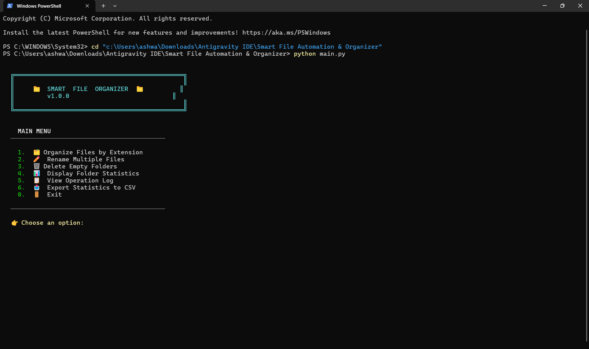
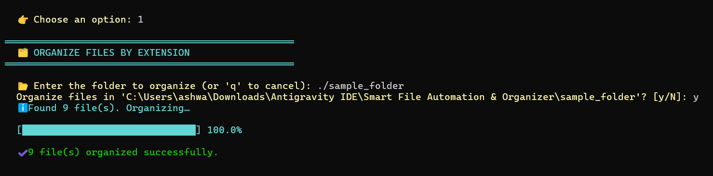
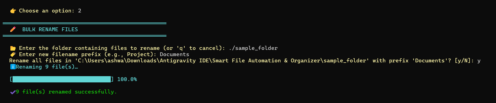
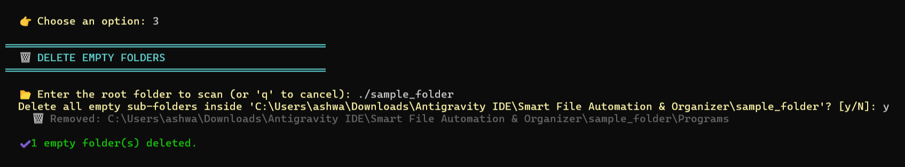
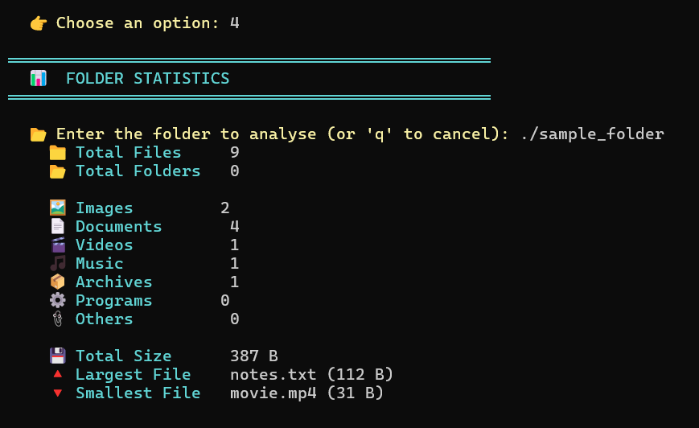
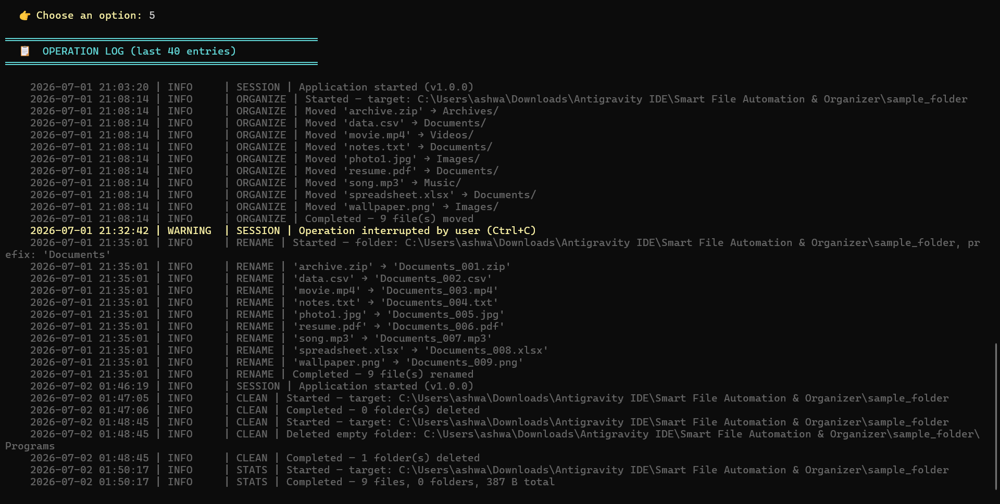
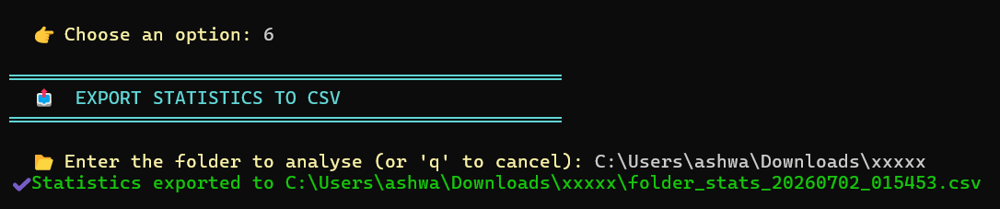
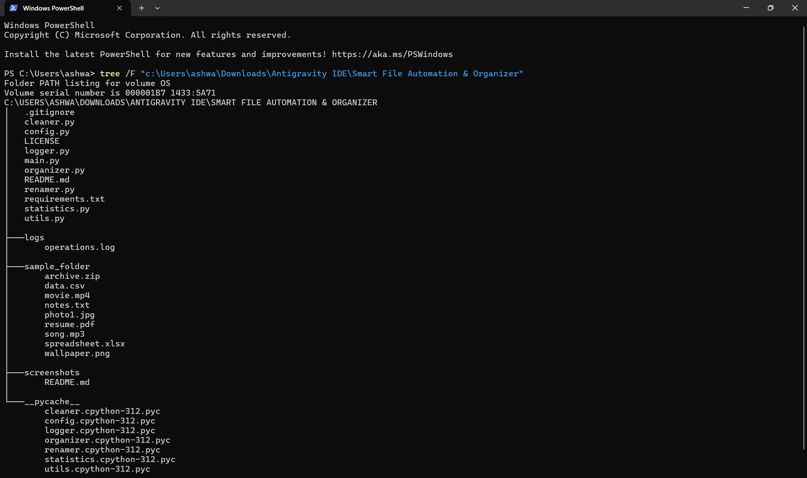
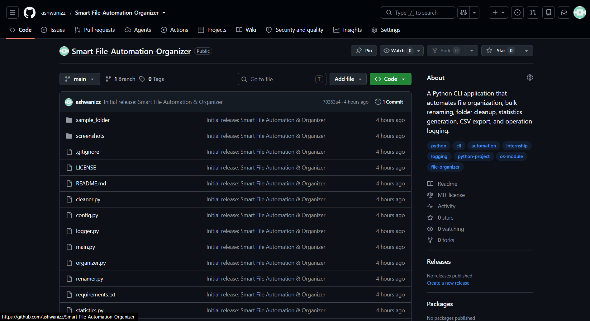

# 📁 Smart File Automation & Organizer

A powerful command-line Python application that automates common file management tasks — organize files by type, bulk-rename, clean empty folders, and generate detailed statistics with full operation logging.


---

## 📋 Table of Contents

- [Features](#-features)
- [Technologies Used](#-technologies-used)
- [Installation](#-installation)
- [How to Run](#-how-to-run)
- [Project Structure](#-project-structure)
- [Sample Input / Output](#-sample-input--output)
- [Screenshots](#-screenshots)
- [Future Improvements](#-future-improvements)
- [License](#-license)

---

## ✨ Features

| # | Feature | Description |
|---|---------|-------------|
| 1 | **🗂 Organize Files** | Automatically sort files into categorized folders (Images, Documents, Videos, Music, Archives, Programs, Others) based on file extension |
| 2 | **✏️ Bulk Rename** | Rename all files in a folder with a custom prefix and sequential numbering (`Report_001.pdf`, `Report_002.docx`, …) |
| 3 | **🗑 Delete Empty Folders** | Recursively scan and remove empty sub-directories |
| 4 | **📊 Folder Statistics** | Display total files, folders, category breakdown, total size, and largest / smallest files |
| 5 | **📋 Operation Log** | View timestamped logs of every action performed |
| 6 | **📤 Export to CSV** | Export folder statistics to a CSV report |

### 🎁 Bonus Features

- 🎨 **Colorized terminal output** — ANSI escape codes with zero external dependencies
- 📊 **Progress bar** — animated `[████████░░░░] 65.0%` for long operations
- 🛡 **Duplicate handling** — auto-suffixes filenames to prevent overwrites
- 📤 **CSV export** — timestamped statistical reports
- 🔧 **Centralized configuration** — all extension categories in `config.py` for easy customization

---

## 🛠 Technologies Used

| Technology | Purpose |
|------------|---------|
| **Python 3.10+** | Core language |
| `os` | File / directory operations (`listdir`, `walk`, `rename`, `rmdir`, `makedirs`, `path`) |
| `shutil` | Moving files across directories |
| `logging` | Persistent operation logging to `logs/operations.log` |
| `csv` | Statistics export |
| `sys` | Terminal control (progress bar rendering) |
| `datetime` | Timestamped CSV filenames |

> **No external dependencies required.** The project uses only the Python standard library.

---

## 📦 Installation

```bash
# 1. Clone the repository
git clone https://github.com/your-username/Smart-File-Automation-Organizer.git
cd Smart-File-Automation-Organizer

# 2. (Optional) Create a virtual environment
python -m venv venv
source venv/bin/activate        # macOS / Linux
venv\Scripts\activate           # Windows

# 3. Install dependencies (none required — standard library only)
pip install -r requirements.txt
```

### Requirements

- **Python 3.10** or higher
- No third-party packages needed

---

## 🚀 How to Run

```bash
python main.py
```

You'll see an interactive menu:

```
  ╔══════════════════════════════════════════════╗
  ║                                              ║
  ║     📁  SMART  FILE  ORGANIZER  📁          ║
  ║         v1.0.0                               ║
  ║                                              ║
  ╚══════════════════════════════════════════════╝

    MAIN MENU
  ──────────────────────────────────────────

    1.  🗂  Organize Files by Extension
    2.  ✏️  Rename Multiple Files
    3.  🗑  Delete Empty Folders
    4.  📊  Display Folder Statistics
    5.  📋  View Operation Log
    6.  📤  Export Statistics to CSV
    0.  🚪  Exit

  ──────────────────────────────────────────

  👉 Choose an option:
```

---

## 📂 Project Structure

```
Smart-File-Automation-Organizer/
│
├── main.py              # Entry point — CLI menu & dispatch
├── config.py            # Extension mappings, colours, constants
├── organizer.py         # Feature 1: Organize files by extension
├── renamer.py           # Feature 2: Bulk rename files
├── cleaner.py           # Feature 3: Delete empty folders
├── statistics.py        # Feature 4: Folder statistics & CSV export
├── logger.py            # Logging setup (logs/operations.log)
├── utils.py             # Shared helpers (validation, progress bar)
│
├── requirements.txt     # Dependencies (standard library only)
├── README.md            # This file
├── LICENSE              # MIT License
├── .gitignore           # Git ignore rules
│
├── logs/                # Auto-created operation logs
│   └── operations.log
│
├── sample_folder/       # Test files for quick demo
│   ├── photo1.jpg
│   ├── wallpaper.png
│   ├── resume.pdf
│   ├── notes.txt
│   ├── spreadsheet.xlsx
│   ├── data.csv
│   ├── movie.mp4
│   ├── song.mp3
│   └── archive.zip
│
└── screenshots/         # Screenshots for documentation
```

---

## 📖 Sample Input / Output

### Feature 1 — Organize Files by Extension

**Input:**

```
📂 Enter the folder to organize: ./sample_folder
Organize files in './sample_folder'? [y/N]: y
```

**Before:**
```
sample_folder/
├── photo1.jpg
├── wallpaper.png
├── resume.pdf
├── notes.txt
├── spreadsheet.xlsx
├── data.csv
├── movie.mp4
├── song.mp3
└── archive.zip
```

**Output:**
```
ℹ Found 9 file(s). Organizing…

  [██████████████████████████████] 100.0%

✔ 9 file(s) organized successfully.
```

**After:**
```
sample_folder/
├── Images/
│   ├── photo1.jpg
│   └── wallpaper.png
├── Documents/
│   ├── resume.pdf
│   ├── notes.txt
│   ├── spreadsheet.xlsx
│   └── data.csv
├── Videos/
│   └── movie.mp4
├── Music/
│   └── song.mp3
├── Archives/
│   └── archive.zip
├── Programs/
└── Others/
```

---

### Feature 2 — Bulk Rename

**Input:**

```
📂 Enter the folder containing files to rename: ./Documents
🏷  Enter new filename prefix: Project
Rename all files in './Documents' with prefix 'Project'? [y/N]: y
```

**Before:**
```
Documents/
├── resume.pdf
├── notes.txt
├── spreadsheet.xlsx
└── data.csv
```

**Output:**
```
ℹ Renaming 4 file(s)…

  [██████████████████████████████] 100.0%

✔ 4 file(s) renamed successfully.
```

**After:**
```
Documents/
├── Project_001.csv
├── Project_002.pdf
├── Project_003.txt
└── Project_004.xlsx
```

---

### Feature 3 — Delete Empty Folders

**Input:**

```
📂 Enter the root folder to scan: ./TestFolder
Delete all empty sub-folders inside './TestFolder'? [y/N]: y
```

**Folder structure before:**
```
TestFolder/
├── Old/           (empty)
├── Backup/        (empty)
├── Reports/
│   └── Q1.pdf
├── Empty1/        (empty)
└── Empty2/        (empty)
```

**Output:**
```
  🗑  Removed: TestFolder/Old
  🗑  Removed: TestFolder/Backup
  🗑  Removed: TestFolder/Empty1
  🗑  Removed: TestFolder/Empty2

✔ 4 empty folder(s) deleted.
```

---

### Feature 4 — Folder Statistics

**Input:**

```
📂 Enter the folder to analyse: ./ProjectFiles
```

**Output:**

```
    📁 Total Files       35
    📂 Total Folders     12

    🖼  Images           8
    📄 Documents         14
    🎬 Videos            5
    🎵 Music             4
    📦 Archives          2
    ⚙  Programs          0
    📎 Others            2

    💾 Total Size        452.38 MB
    🔺 Largest File      presentation.mp4 (198.50 MB)
    🔻 Smallest File     notes.txt (45 B)
```

---

### Feature 5 — Operation Log

**Output (color-coded in terminal):**

```
    2026-07-01 18:32:15 | INFO     | SESSION | Application started (v1.0.0)
    2026-07-01 18:32:18 | INFO     | ORGANIZE | Started — target: C:\sample_folder
    2026-07-01 18:32:18 | INFO     | ORGANIZE | Moved 'photo1.jpg' → Images/
    2026-07-01 18:32:18 | INFO     | ORGANIZE | Moved 'resume.pdf' → Documents/
    2026-07-01 18:32:18 | INFO     | ORGANIZE | Moved 'movie.mp4' → Videos/
    2026-07-01 18:32:18 | INFO     | ORGANIZE | Moved 'song.mp3' → Music/
    2026-07-01 18:32:18 | INFO     | ORGANIZE | Moved 'archive.zip' → Archives/
    2026-07-01 18:32:18 | INFO     | ORGANIZE | Completed — 9 file(s) moved
    2026-07-01 18:33:01 | INFO     | RENAME | Started — folder: C:\Documents, prefix: 'Project'
    2026-07-01 18:33:01 | INFO     | RENAME | 'resume.pdf' → 'Project_001.pdf'
    2026-07-01 18:33:01 | INFO     | RENAME | 'notes.txt' → 'Project_002.txt'
    2026-07-01 18:33:01 | INFO     | RENAME | Completed — 4 file(s) renamed
    2026-07-01 18:34:12 | INFO     | CLEAN | Started — target: C:\TestFolder
    2026-07-01 18:34:12 | INFO     | CLEAN | Deleted empty folder: C:\TestFolder\Old
    2026-07-01 18:34:12 | INFO     | CLEAN | Completed — 4 folder(s) deleted
    2026-07-01 18:35:00 | INFO     | STATS | Completed — 35 files, 12 folders, 452.38 MB total
```

---

### Feature 6 — CSV Export

**Output:**

```
✔ Statistics exported to ./ProjectFiles/folder_stats_20260701_183500.csv
```

**Generated CSV contents:**

| Metric | Value |
|--------|-------|
| Total Files | 35 |
| Total Folders | 12 |
| Total Size (bytes) | 474439680 |
| Largest File | presentation.mp4 |
| Smallest File | notes.txt |

| Category | Count |
|----------|-------|
| Archives | 2 |
| Documents | 14 |
| Images | 8 |
| Music | 4 |
| Others | 2 |
| Videos | 5 |

---

## 📸 Screenshots

### 1. Main Menu


### 2. Organize Files


### 3. Bulk Rename


### 4. Delete Empty Folders


### 5. Folder Statistics


### 6. Operation Log


### 7. CSV Export


### 8. Project Structure


### 9. GitHub Repository


---

## 🔮 Future Improvements

- [ ] **Undo last operation** — maintain a journal to reverse the most recent action
- [ ] **Configuration file** — YAML/JSON config for custom extension categories
- [ ] **Scheduled automation** — watch a folder and auto-organize on file arrival
- [ ] **GUI version** — Tkinter or web-based interface
- [ ] **Dry-run mode** — preview changes without moving/renaming files
- [ ] **Multi-language support** — i18n for menu strings
- [ ] **Search functionality** — find files by name, size, or date across directories

---

## 📄 License

This project is licensed under the **MIT License** — see the [LICENSE](LICENSE) file for details.

---

## 🙌 Acknowledgements

Built as an internship-level project demonstrating proficiency in:

- Python `os` module & file system operations
- Exception handling & defensive programming
- The `logging` standard library module
- Modular, PEP 8-compliant code architecture
- CLI user experience design

---

> Made with ❤️ in Python
